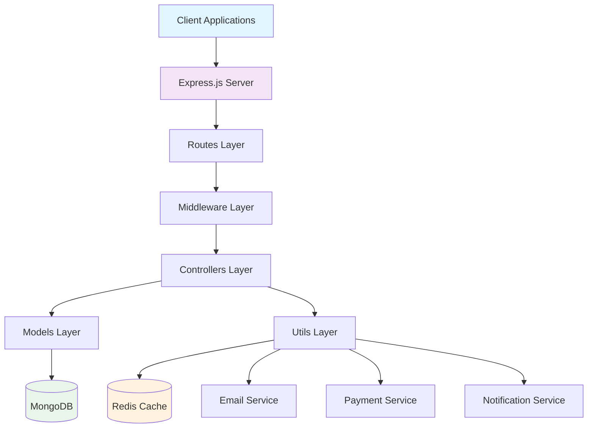
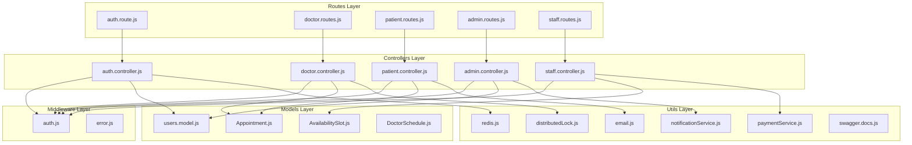
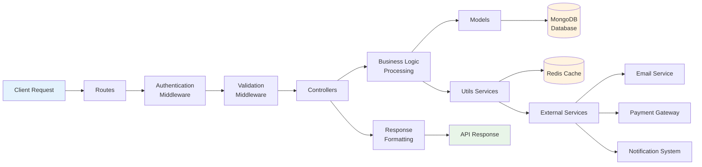
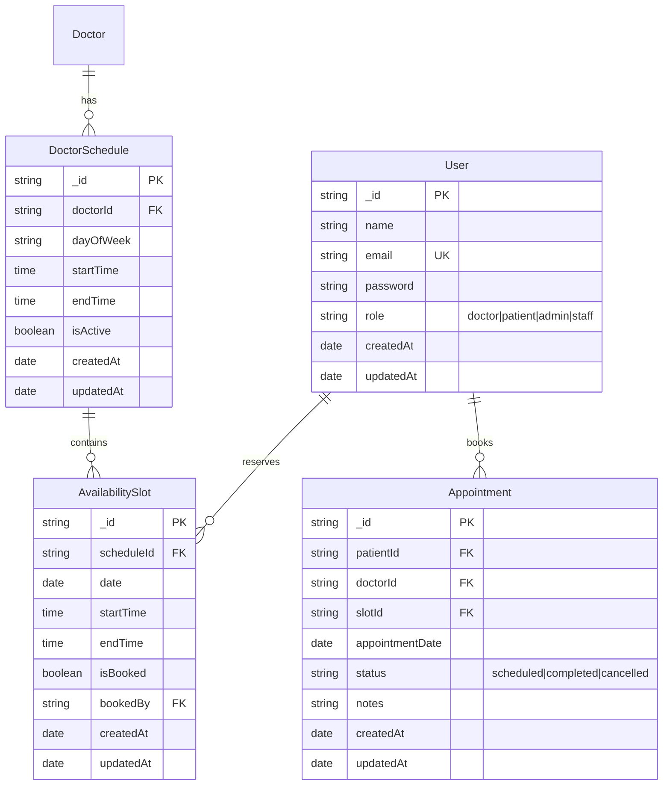
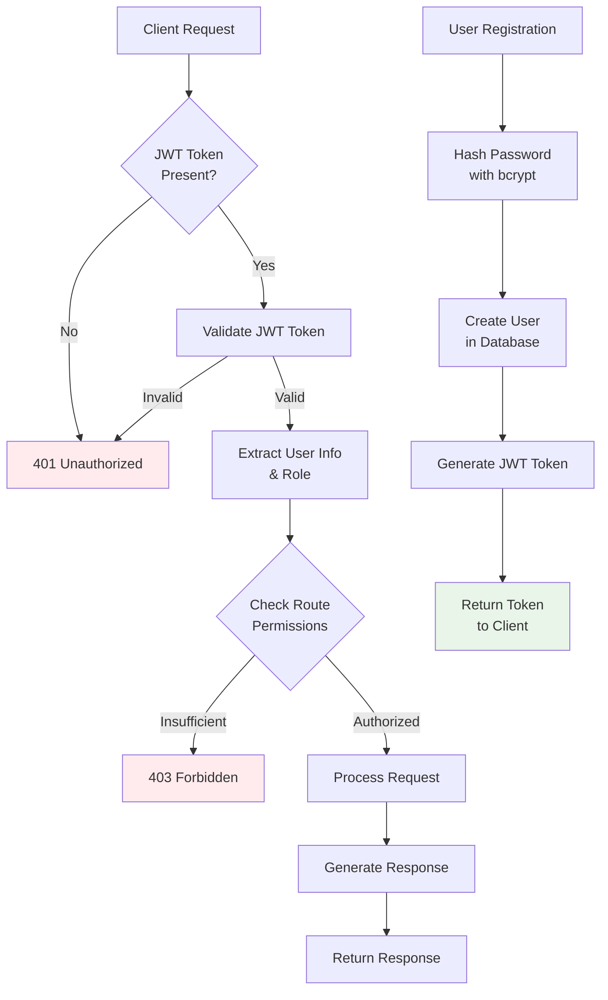
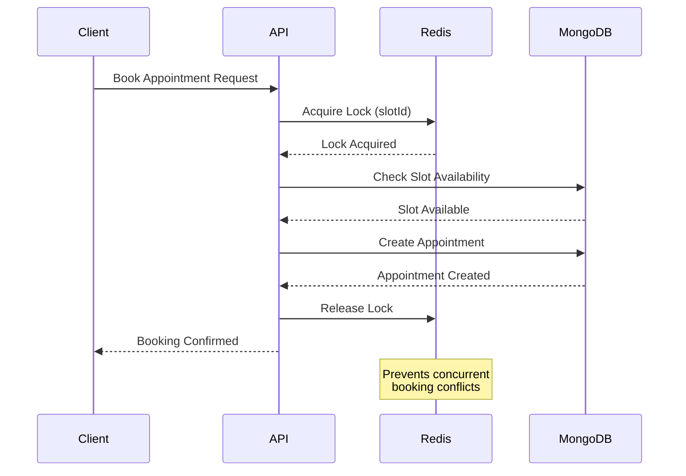

# Appointment Management System Backend

A comprehensive Node.js backend service for managing medical appointments, built with Express.js, MongoDB, and Redis. This system provides a complete appointment booking platform with role-based access control for doctors, patients, administrators, and staff.

## Table of Contents

1. [Features](#features)
2. [Architecture](#architecture)
3. [Technology Stack](#technology-stack)
4. [Project Structure](#project-structure)
5. [Prerequisites](#prerequisites)
6. [Installation](#installation)
7. [Configuration](#configuration)
8. [Running the Application](#running-the-application)
9. [API Documentation](#api-documentation)
10. [Testing](#testing)
11. [Docker Setup](#docker-setup)
12. [Deployment](#deployment)
13. [Contributing](#contributing)
14. [License](#license)

## Features

### Authentication & Authorization
- JWT-based authentication system
- Role-based access control (Doctor, Patient, Admin, Staff)
- Secure password hashing with bcrypt
- User registration and login

### Doctor Management
- Doctor onboarding and profile management
- Schedule management with availability slots
- Doctor search and filtering capabilities

### Patient Services
- Appointment booking and management
- Appointment history and status tracking
- Patient profile management

### Administrative Functions
- User management across all roles
- System-wide appointment oversight
- Doctor management and approval workflows

### Staff Operations
- Slot management for doctors
- Administrative support functions
- Appointment coordination

### Advanced Features
- **Distributed Locking**: Redis-based distributed locks for concurrent appointment booking
- **Email Notifications**: Automated email notifications for appointments
- **Payment Integration**: Payment processing capabilities
- **Logging**: Comprehensive logging with Winston
- **Error Handling**: Centralized error handling middleware
- **API Documentation**: Auto-generated Swagger/OpenAPI documentation

### Testing & Quality Assurance
- **Unit Tests**: Comprehensive unit test coverage
- **Integration Tests**: End-to-end API testing
- **Stress Testing**: Load testing with Artillery
- **Code Coverage**: Detailed test coverage reports

## Architecture

The system follows a modular, microservices-inspired architecture built on Express.js:

### System Architecture Overview



### Core Components Architecture



### Data Flow Architecture



### Database Design



### Security Architecture



### Distributed Locking Flow



## Technology Stack

### Backend Framework
- **Node.js**: Runtime environment
- **Express.js**: Web framework for API development

### Database & Caching
- **MongoDB**: NoSQL database with Mongoose ODM
- **Redis**: In-memory data structure store for caching and locking

### Authentication & Security
- **JWT**: JSON Web Tokens for authentication
- **bcryptjs**: Password hashing
- **Helmet**: Security middleware (implied through Express setup)

### Documentation & Testing
- **Swagger/OpenAPI**: API documentation
- **Jest**: Unit and integration testing
- **Artillery**: Load and stress testing
- **Supertest**: HTTP endpoint testing

### Utilities
- **Winston**: Logging framework
- **Nodemailer**: Email service
- **Docker**: Containerization

## Project Structure

```
├── app.js                 # Main application entry point
├── server.js              # Server configuration
├── package.json           # Dependencies and scripts
├── Dockerfile             # Docker container configuration
├── makefile               # Build automation
├── babel.config.cjs       # Babel configuration
├── controllers/           # Business logic controllers
│   ├── auth.controller.js
│   ├── admin/
│   ├── doctor/
│   ├── patient/
│   └── staff/
├── models/                # MongoDB data models
│   ├── users.model.js
│   ├── Appointment.js
│   ├── AvailabilitySlot.js
│   └── DoctorSchedule.js
├── routes/                # API route definitions
│   ├── auth.route.js
│   ├── doctor.routes.js
│   ├── patient.routes.js
│   ├── admin.routes.js
│   ├── staff.routes.js
│   └── hello.route.js
├── middlewares/           # Express middleware
│   ├── auth.js
│   └── error.js
├── utils/                 # Utility functions
│   ├── redis.js
│   ├── email.js
│   ├── notificationService.js
│   ├── paymentService.js
│   ├── distributedLock.js
│   ├── swagger.docs.js
│   └── ApiResponse.util.js
├── tests/                 # Test suites
│   ├── auth/
│   ├── doctor/
│   └── admin/
└── logs/                  # Application logs
```

## Prerequisites

- Node.js 18 or higher
- MongoDB instance (local or cloud)
- Redis instance (local or cloud)
- npm or yarn package manager

## Installation

1. **Clone the repository**
   ```bash
   git clone <repository-url>
   cd backend/core
   ```

2. **Install dependencies**
   ```bash
   npm install
   ```

3. **Environment Setup**
   Create a `.env` file in the root directory with the following variables:
   ```env
   PORT=3000
   MONGODB_URI=mongodb://localhost:27017/medical_app
   REDIS_URL=redis://localhost:6379
   JWT_SECRET=your-jwt-secret-key
   EMAIL_USER=your-email@example.com
   EMAIL_PASS=your-email-password
   ```

## Configuration

### Environment Variables

| Variable | Description | Default |
|----------|-------------|---------|
| `PORT` | Server port | 3000 |
| `MONGODB_URI` | MongoDB connection string | mongodb://localhost:27017/medical_app |
| `REDIS_URL` | Redis connection URL | redis://localhost:6379 |
| `JWT_SECRET` | JWT signing secret | Required |
| `EMAIL_USER` | SMTP email username | Required for email features |
| `EMAIL_PASS` | SMTP email password | Required for email features |

### Database Configuration

The application automatically connects to MongoDB and Redis on startup. Ensure your MongoDB instance is running and accessible.

## Running the Application

### Development Mode
```bash
npm start
```
The server will start on port 3000 with hot reloading enabled.

### Production Mode
```bash
npm run build
npm run serve
```

### Using Makefile
```bash
# Install dependencies
make install

# Run the application
make run

# Run tests
make test

# Build Docker image
make docker-build

# Run Docker container
make docker-run
```

## API Documentation

The API documentation is automatically generated using Swagger/OpenAPI and is available at:

**http://localhost:3000/api-docs**

### Accessing API Documentation

1. Start the application using `npm start` or `make run`
2. Open your browser and navigate to `http://localhost:3000/api-docs`
3. The Swagger UI will display all available endpoints with:
   - Request/response schemas
   - Authentication requirements
   - Example requests and responses
   - Interactive API testing interface

### API Endpoints Overview

- **Authentication**: `/auth/*` - User registration, login, token refresh
- **Doctor Management**: `/doctor/*` - Profile, schedules, availability
- **Patient Services**: `/patient/*` - Appointment booking and management
- **Admin Functions**: `/admin/*` - User and system management
- **Staff Operations**: `/staff/*` - Slot management and support functions

## Testing

The project includes comprehensive testing with multiple test types:

### Running Tests

```bash
# Run all tests
npm test

# Run with coverage report
npm run test:coverage

# Run specific test types
npm run test:unit          # Unit tests
npm run test:integration   # Integration tests
npm run test:auth:stress   # Authentication stress tests
npm run test:doctor:stress # Doctor onboarding stress tests

# Load testing with Artillery
npm run test:load              # General load test
npm run test:load:registration # Registration load test
npm run test:load:login        # Login load test
```

### Test Structure

- **Unit Tests**: Test individual functions and modules
- **Integration Tests**: Test API endpoints end-to-end
- **Stress Tests**: Load testing with Artillery for performance validation
- **Coverage Reports**: Generated in `coverage/` directory

### Using Makefile for Testing

```bash
make test          # Run all tests
make test-unit     # Run unit tests
make test-integration  # Run integration tests
make test-stress   # Run stress tests
```

## Docker Setup

### Building the Docker Image

```bash
# Using Docker directly
docker build -t backend-core .

# Using Makefile
make docker-build
```

### Running with Docker

```bash
# Using Docker directly
docker run -d --name backend-core-container -p 3000:3000 backend-core

# Using Makefile
make docker-run
```

### Docker Environment Variables

When running with Docker, pass environment variables:

```bash
docker run -d \
  --name backend-core-container \
  -p 3000:3000 \
  -e MONGODB_URI=mongodb://host.docker.internal:27017/medical_app \
  -e REDIS_URL=redis://host.docker.internal:6379 \
  -e JWT_SECRET=your-secret-key \
  backend-core
```

### Stopping Docker Container

```bash
# Using Docker directly
docker stop backend-core-container
docker rm backend-core-container

# Using Makefile
make docker-stop
```

### Docker Compose (if applicable)

If you have a `docker-compose.yml` file:

```bash
docker-compose up -d
```

## Deployment

### Production Deployment Checklist

1. **Environment Variables**: Set all required environment variables
2. **Database**: Ensure MongoDB and Redis are accessible
3. **Security**: Use strong JWT secrets and secure email credentials
4. **Monitoring**: Set up logging and monitoring
5. **Scaling**: Configure load balancing if needed

### CI/CD Pipeline

The project includes GitHub Actions workflows for:
- Automated testing
- Code quality checks
- Security scanning
- Docker image building
- Deployment automation

### Release Process

```bash
# Update version in package.json
# Commit changes
git tag v1.2.3
git push origin v1.2.3
# GitHub Actions will create the release automatically
```

## Contributing

1. Fork the repository
2. Create a feature branch (`git checkout -b feature/amazing-feature`)
3. Commit your changes (`git commit -m 'Add amazing feature'`)
4. Push to the branch (`git push origin feature/amazing-feature`)
5. Open a Pull Request

### Development Guidelines

- Follow ESLint configuration
- Write tests for new features
- Update API documentation for new endpoints
- Use conventional commit messages
- Ensure all tests pass before submitting PR

## License

This project is licensed under the ISC License - see the LICENSE file for details.

---

**Author**: Ashrith Sai
**Version**: 1.0.0
**Last Updated**: 2024</content>
<parameter name="filePath">d:\amrutham\backend\core\README.md